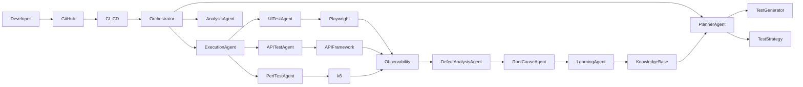
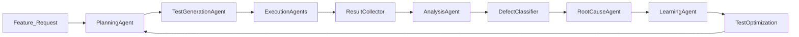
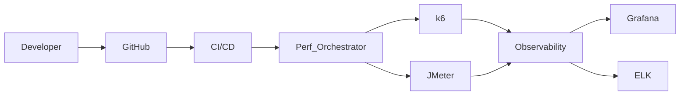

<h1 align="center">Ashwin Kulkarni</h1>

   
  

<h3 align="center">
Director / Head of Quality Engineering • Cloud-Native Testing • AI Driven QA
</h3>

Building the future of <b>Autonomous QA Platforms</b> using AI agents, cloud infrastructure, and modern automation frameworks.

---

# 👨‍💼 About Me

Quality Engineering leader with **18+ years of experience** designing
and scaling testing platforms for enterprise SaaS systems.

My focus areas include:

• Autonomous QA Systems\
• AI-driven Test Generation\
• Cloud Native Testing Platforms\
• Performance Engineering\
• Observability Driven Testing

Currently exploring how **AI Agents and LLM workflows can transform
software testing into autonomous systems.**

---

# 🧠 Core Expertise

| Domain | Focus |
|------|------|
| Quality Engineering | Enterprise QA strategy and automation transformation |
| Cloud Testing | AWS, Kubernetes, Microservices testing |
| Automation | Playwright, API testing, CI/CD pipelines |
| Performance Engineering | k6, JMeter, Observability driven testing |
| AI for QA | LLM powered test generation and autonomous QA |

---

# 🧰 Technology Stack

### Automation

### Languages

### Cloud & DevOps

---

# 🤖 AI & Agentic Architecture (Autonomous QA Platform)

The Autonomous QA Platform implements a **multi-agent architecture** where specialized AI agents collaborate to design, execute and analyze tests automatically.

The platform integrates **LLMs, QA frameworks, observability systems and CI/CD pipelines** to create a fully autonomous testing loop.

---

## 🧠 AI Stack

---

## 🧠 Autonomous QA Agent Architecture

---

## 🤖 Autonomous Testing Agent Flow

---

## 🏗 Performance Testing Platform Architecture

---

# 🧩 AI Agents in the Platform

| Agent                | Responsibility                                      |
| -------------------- | --------------------------------------------------- |
| Planner Agent        | Understand feature changes and define test strategy |
| Test Generator Agent | Generate test cases using LLMs                      |
| Execution Agents     | Run UI, API and performance tests                   |
| Analysis Agent       | Analyze failures and detect anomalies               |
| Root Cause Agent     | Identify root cause using logs and traces           |
| Learning Agent       | Improve test coverage based on past runs            |

---

🏗 Platform Components

| Component           | Technology                    |
| ------------------- | ----------------------------- |
| Test Automation     | Playwright                    |
| API Testing         | REST frameworks               |
| Performance Testing | k6 / JMeter                   |
| Observability       | ELK / Grafana                 |
| Agent Framework     | LangChain / Python            |
| LLM Integration     | OpenAI APIs                   |
| CI/CD Integration   | GitHub Actions / Azure DevOps |
| GitHub Copilot | AI pair programmer for writing automation frameworks    |
| Claude Code    | Architecture reasoning and complex code generation      |
| OpenAI APIs    | LLM integration for test generation and defect analysis |
| VS Code        | AI-enabled development environment                      |

---

🚀 AI Capabilities Implemented

✔ AI-driven test case generation
✔ Autonomous regression selection
✔ Defect clustering using LLMs
✔ Root cause analysis from logs
✔ Intelligent test prioritization
✔ Performance anomaly detection

---

# 🤝 Open to Opportunities

• Director of QA\
• Head of Quality Engineering\
• QE Transformation Leadership\
• AI Driven QA Platforms

---

⭐ If you're building **AI-driven testing platforms or Autonomous QA
systems**, feel free to connect.
